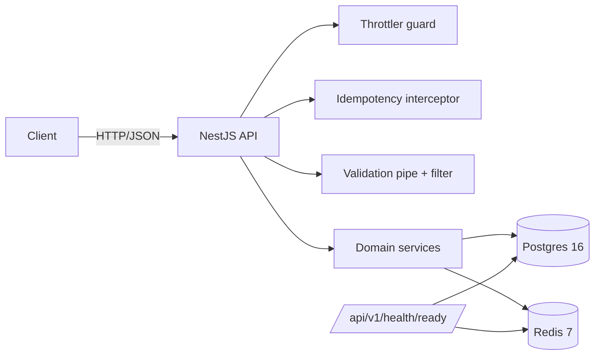
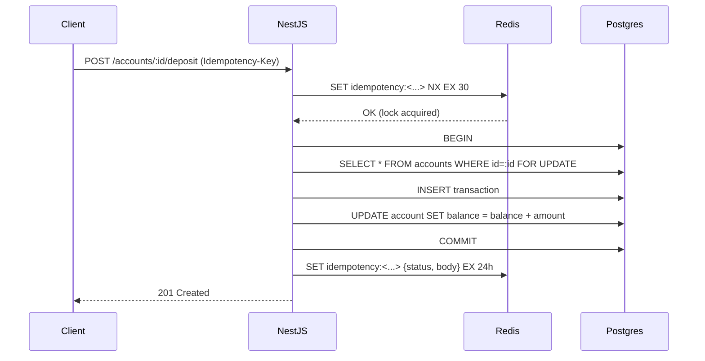

# Architecture

## High level

A NestJS HTTP service in front of Postgres (system of record) and Redis (cache + lock +
rate limit). One process, no message broker, no background workers — everything happens
on the request path inside a single DB transaction.



## Modules

The codebase is split into thin domain modules. Each module owns its controller,
service, repository, DTOs, and entity definitions. Modules talk through the public
service exports; repositories don't cross module boundaries.

```
src/modules/
  persons/        read-only, only exists so Account can have a relation
  accounts/       create, fetch, balance, block
  transactions/   deposit, withdraw, statement (the only place that mutates balance)
  idempotency/    Redis-backed replay layer, applied via APP_INTERCEPTOR
  health/         /health and /health/ready
```

`AccountsModule` exports `AccountsRepository` so `TransactionsService` can take a
row-level lock without going through another service layer. That coupling is deliberate:
balance mutations live in one place (`TransactionsService`) and need direct access to
the locking primitive.

## Request lifecycle

1. `RequestIdMiddleware` reads `X-Request-Id` (validates as UUID) or generates a UUIDv4.
   The id is attached to every Pino log line.
2. `helmet`, `compression`, JSON body limit (`100kb`), CORS.
3. `ThrottlerGuard` (per-IP bucket).
4. `IdempotencyInterceptor` (only on mutating methods with an `Idempotency-Key` header).
5. `ValidationPipe` (whitelisted DTOs, `forbidNonWhitelisted: true`).
6. Controller → service → repository.
7. `GlobalExceptionFilter` maps domain errors and `HttpException` to a single envelope.

## Money math

All amounts are `numeric(19,4)` in Postgres and pass through `decimal.js` in the
service layer (`src/common/money/money.ts`). The `formatMoney` helper rounds half-up to
4 decimal places on every write. JSON responses always serialize money as a string —
the OpenAPI spec advertises this so clients don't get burned.

The cents-as-integer alternative was considered and rejected because reports run raw
SQL math and `numeric(19,4)` keeps that ergonomic. The trade-off is that the service
layer has to be careful never to feed amounts through a JS `Number`.

## Concurrency



The lock is held by Postgres for the duration of the transaction. The next concurrent
request on the same row blocks at the `SELECT ... FOR UPDATE` step and runs after the
first commit. The 100-vu stress test in `test/integration/transactions.service.int-spec.ts`
verifies that 100 concurrent $10 withdrawals against a $500 balance produce exactly
50 successes, 50 `INSUFFICIENT_FUNDS`, and a final balance of 0.

## Idempotency

Two layers:

1. **Redis lock + replay cache.** On a mutating request with `Idempotency-Key`:
   - `SET idempotency:<path>:<key> {sentinel} NX EX 30` to acquire a lock.
   - If the lock is taken and the stored value is a payload, replay it.
   - If the lock is taken and the stored value is the pending sentinel, return 409.
   - On success, store `{status, body}` with the configured TTL (default 24h).
   - On failure, release the lock so the client can retry.
2. **DB unique constraint.** `transactions.idempotency_key` is recorded with a partial
   `UNIQUE (account_id, idempotency_key)` index. If Redis is wiped, a duplicate request
   gets caught at the DB layer; the service catches the violation and returns the
   existing row.

## Error envelope

A single `GlobalExceptionFilter` produces:

```json
{
  "statusCode": 409,
  "error": "Conflict",
  "message": "Account aaa has insufficient funds",
  "code": "INSUFFICIENT_FUNDS",
  "requestId": "8f3b...",
  "timestamp": "2026-04-27T10:00:00.000Z"
}
```

Domain errors live in `src/common/errors` and each one declares its `httpStatus` and
`code`. Validation errors go through `BadRequestException` and use the same envelope.
500s log the underlying error with `requestId`; the response itself carries no internals.

## Configuration

`@nestjs/config` loads `.env`, `src/config/validation.schema.ts` validates with Joi.
The app refuses to start if anything required is missing or malformed. `ConfigModule`
is global so any module can `inject: [ConfigService]`.

## Logging

`nestjs-pino`. JSON in production, pretty-printed in dev. Every line carries
`requestId`. Sensitive headers (`authorization`, `cookie`) are redacted. Bodies are
not logged on purpose.

## Testing pyramid

```
unit (44 tests, src/**/*.spec.ts)
  └── pure logic with mocked deps
integration (11 tests, test/integration/*.int-spec.ts)
  └── real Postgres + Redis via docker-compose.test.yml
e2e (20 tests, test/e2e/*.e2e-spec.ts)
  └── full Nest app + Supertest, all endpoints
load (k6, test/load/*.js)
  └── deposit burst, withdraw contention, mixed traffic — opt-in
```

## What I would change if this were going to production

- Move account-number generation off `MAX(...) + 1` to a dedicated Postgres sequence or
  a separate generator service.
- Add an authn/z layer (JWT or API key). The DI seam is already there in
  `src/common/`.
- Replace the per-request idempotency key with one signed by the caller, plus an
  optional payload hash so accidental key reuse with a different body is detected and
  rejected.
- Promote `daily_withdrawal_limit` to an `account_products` table.
- Run statement reads against a read replica and use `repeatable read` for them.
- Surface Prometheus metrics — Pino is good for tracing but not for SLOs.
